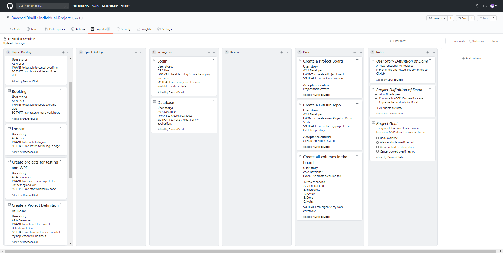
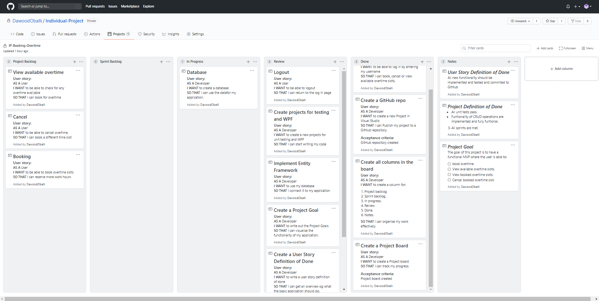
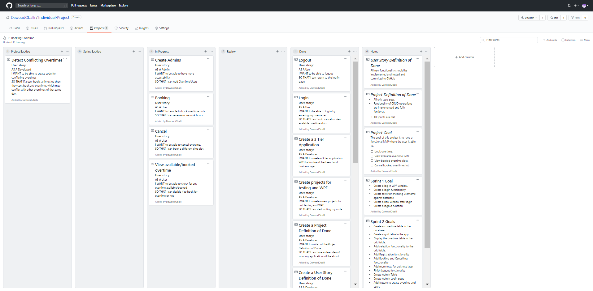
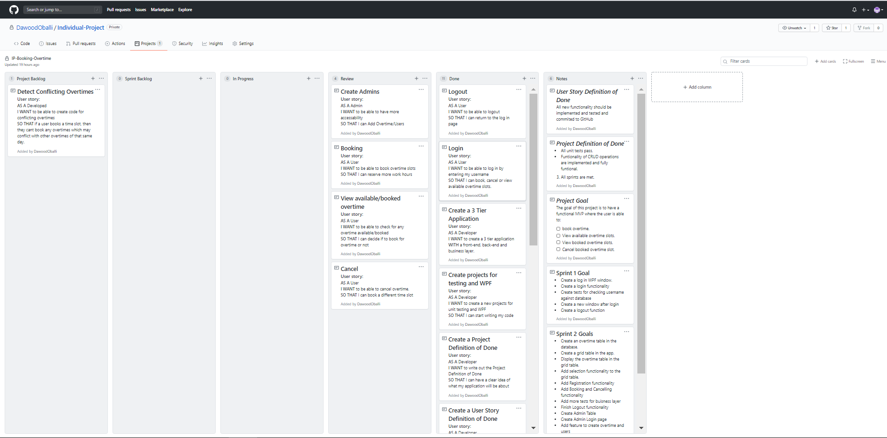
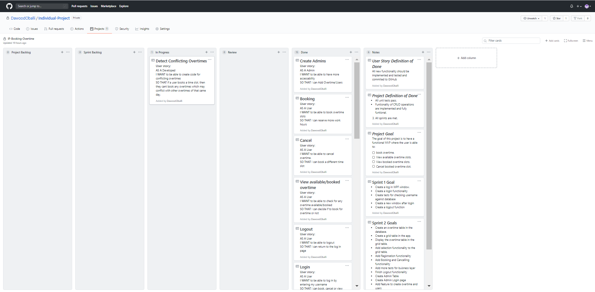
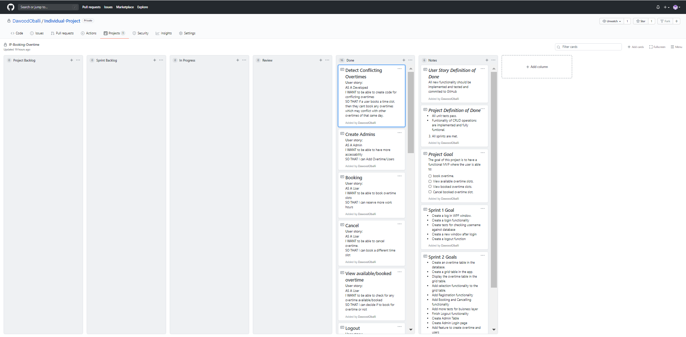
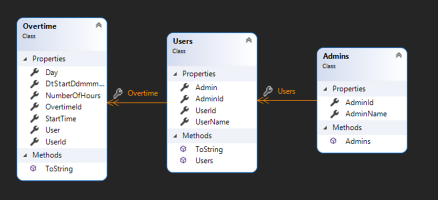

# Project Goal:  

The goal of this project is to have a functional MVP where the user is able to:

- [ ] Login/Logout.

- [ ] book overtime.
- [ ] View available overtime slots.
- [ ] View booked overtime slots.
- [ ] Cancel booked overtime slot. 

# Project Definition of Done:

* All unit tests pass.
* Functionality of CRUD operations are implemented and fully functional.

* All sprints are met.

## Sprint 1

#### Goal: Create a fully functional login window.

#### Review: 

| COMPLETE | INCOMPLETE |
| :------- | ---------- |
| Login    | Logout     |

#### Retrospective:

* **Learned**: Ask for help initially before attempting to solve the problem on my own.
* **Do Differently:** Write out all the user stories first then begin implementing them.
* **Next time:** Make sure if any user stories are finished before the end of the sprint then add another user story to the sprint backlog.

#### Project Board Overview:

**START OF SPRINT 1**

**END OF SPRINT 1**

-----------------------------------------------------------------------------END OF SPRINT 1-------------------------------------------------------------------------------------

## Sprint 2

#### Goals: 

* Create Registration page
* Create Overtime table
* Add registration functionality
* Add Booking/Cancelling functionality
* Add tests to test new functionality
* Finish Logout Functionality
* Create Admins Table
* Add feature to create overtime and users

#### Review: 

| COMPLETE                       | INCOMPLETE |
| :----------------------------- | ---------- |
| Logout                         |            |
| Cancel                         |            |
| Book                           |            |
| Register                       |            |
| View Booked/Available Overtime |            |

#### Retrospective:

* **Learned**: Ensure to plan out whether to use database first or model first approach.
* **Do Differently:** Create an ERD diagram to map out what I will need for my database.
* **Next time:** Ensure an ERD is created at the start.

#### Project Board Overview:

**START OF SPRINT 2**

**END OF SPRINT 2**

-----------------------------------------------------------------------------END OF SPRINT 2-------------------------------------------------------------------------------------

## Sprint 3

#### Goals: 

* Add code to determine conflicting overtimes when booking.
* Finish all tests for newly added functionality.

#### Review: 

| COMPLETE                                                 | INCOMPLETE |
| :------------------------------------------------------- | ---------- |
| Create more tests and pass them                          |            |
| Add feature to detect if overtimes conflict when booking |            |

#### Retrospective:

* **Learned**: How to test for conflicting time ranges.
* **Do Differently:** Map out all possibilities where conflicting times can occur and cant occur.
* **Next time:** Look up how to simplify coding for better layout.

#### Project Board Overview:

**START OF SPRINT 3**

**END OF SPRINT 3**

-----------------------------------------------------------------------------END OF SPRINT 3-------------------------------------------------------------------------------------

#### Class Diagram

### Final Project Retrospective

**Liked:** Implement everything that was presented to us and learned from and make it work. Also having the freedom to pick out a problem which can be a real one and find a solution for it is something that feel very rewarding.

**Learned:** Definitely try and ask for help first before trying to solve the issue on my own. Also, Make sure to plan out and brainstorm what my application should do and all the possible features it can have within the time frame prior to starting the project.

**Disliked:** The time frame that was given was a bit shorter than desired. Also, start the project at the start of the week so that it does not roll over to the weekend as that was very exhausting: mentally and physically.